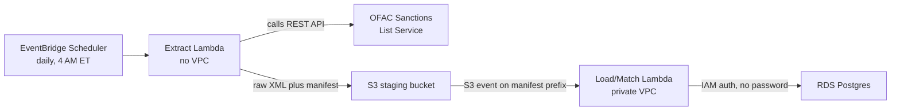

# OFAC Sanctions Screening Pipeline

A serverless AWS pipeline that pulls the U.S. Treasury's OFAC Specially Designated Nationals (SDN) sanctions list from its live REST API, loads it into Postgres, and fuzzy-matches a customer population against it, the same kind of screening control that runs at banks and fintechs, running fully automated on a daily schedule.

## What this does

Every day, on its own, this pipeline:

1. Pulls the current SDN list (~19,400 entities and their aliases) from OFAC's Sanctions List Service API
2. Loads it into RDS Postgres, updating existing records and adding new ones without duplicating anything on repeat runs
3. Adds a few new synthetic customers, including one drawn from that day's real, current SDN data
4. Screens every customer against the full list using fuzzy string matching
5. Logs the outcome of the run, whether it succeeded, failed, or partially failed, so nothing goes unrecorded

No manual steps. No stored passwords. No public database endpoint.

## Architecture



Two Lambda functions, split by what each one actually needs to reach, not by what step they perform:

- **Extract** has no VPC attachment, so it gets default internet access to call OFAC's public API, at zero networking cost.
- **Load/Match** runs in a private VPC subnet with no route to the internet at all. It never needs one: S3 is reachable through a free VPC Gateway Endpoint, and RDS is reachable privately within the same VPC. This is also why a NAT Gateway (~$32/month, no free tier) was never needed.
- The two are connected by an **S3 event on the `manifest/` prefix**, not a second independent schedule. Extract always writes a manifest, on success or failure, which is what lets a failed extract still get logged downstream instead of the run disappearing silently.

## Design decisions worth knowing about

- **REST API over bulk file downloads.** OFAC publishes both. The bulk files are more efficient for a one-time load; the REST API is what this project deliberately chose, since demonstrating real API integration was the actual point.
- **`pg8000` over `psycopg2`.** `psycopg2` is a compiled C extension; installing it on a Mac produces a binary that won't run on Lambda's Linux environment. `pg8000` is pure Python, so what's tested locally is exactly what runs in production. `rapidfuzz`'s compiled component gets built for the right platform via a Docker step instead.
- **IAM database authentication, not a stored password.** The Load/Match Lambda's execution role generates a short-lived login token per connection. There is no long-lived database credential anywhere in this system to leak.
- **Match history is never deleted or replaced.** Every screening run is its own event; a customer's past matches persist even if the SDN entity they matched later drops off the list, enforced with a `RESTRICT` (not `CASCADE`) foreign key.

## Real bugs found by testing against real data

A few of these were only visible once the pipeline ran against the actual live SDN list (~19,400 entities), not a small hand-built test set:

- **A silent false-positive flood.** The initial matching scorer (`rapidfuzz.fuzz.WRatio`) scored the unrelated name "James Smith" as 90% similar to a real SDN alias, "MIT", because "MIT" is a near-exact substring of "SMITH". Switching to `token_sort_ratio` fixed it, confirmed by re-running the same test against all ~44,000 real candidate names.
- **A threshold recalibration backed by evidence, not a guess.** Seeding real test customers surfaced an actual false positive at the original threshold (85.0): "Donna Thomas" scored 85.71 against a real, short alias ("DON TOMAS"), purely by character-level coincidence. The threshold moved to 88.0, chosen from the real score distribution, not picked in advance.
- **An out-of-memory crash from a bulk XML parse.** Building a full in-memory tree of the live SDN response used ~670 MB beyond the raw file size. Switching to streaming (`iterparse`) parsing dropped that to a few MB.
- **A wrong API endpoint path.** The extract step initially 404'd, since only two of the API's endpoints actually live under `/api/`, the rest (`/entities`, `/alive`) sit at the domain root, something only confirmed by checking the real documentation closely after the live call failed.
- **A dependency masked by the dev environment.** `rapidfuzz.process.cdist` has an undeclared, lazy dependency on `numpy`, invisible in local testing purely because `numpy` happened to already be installed there for an unrelated reason.

## Tech stack

Python 3.14, AWS Lambda, RDS (Postgres 16), S3, EventBridge Scheduler, IAM database authentication, Docker (for building Linux-compatible dependencies), `pg8000`, `rapidfuzz`, `faker`, `pytest`.

## Repository structure

```
docs/               Data Requirements Document, Data Dictionary, Test Plan
db/                 schema.sql, migrations, seed data
pipeline/
  extract_lambda/   Calls the OFAC API, stages results in S3
  load_match_lambda/ Loads SDN data, screens customers, logs results
  tests/            35 tests, run against a real local Postgres, not mocks
```

## Running the tests

```
pip install -r pipeline/requirements-dev.txt
createdb ofac_dbtest
psql -d ofac_dbtest -f db/schema.sql
psql -d ofac_dbtest -c "CREATE USER test_app WITH PASSWORD 'testpass123'; GRANT ALL ON ALL TABLES IN SCHEMA public TO test_app; GRANT ALL ON ALL SEQUENCES IN SCHEMA public TO test_app;"
cd pipeline && python -m pytest tests/
```

The parser and matcher tests run against real, curated SDN records pulled from an actual live API response, not invented data.

## Documentation

- [`docs/DRD_OFAC_Sanctions_Pipeline.docx`](docs/DRD_OFAC_Sanctions_Pipeline.docx): business requirements, architecture, cost, and risk analysis
- [`docs/DATA_DICTIONARY.md`](docs/DATA_DICTIONARY.md): field-level schema, source-to-target mapping from the API
- [`docs/TEST_PLAN.md`](docs/TEST_PLAN.md): test data design and threshold calibration methodology

## Scope

This is a portfolio project, not a certified compliance tool. It covers the SDN list only (not the Consolidated list or other sanctions regimes), uses synthetic customer data throughout, and does not implement the encryption-at-rest and PII controls a production system handling real customer data would require. See the DRD's non-goals section for the full list of deliberate scope decisions.

## Status

Live and running on its daily schedule. GitHub Actions CI/CD (automated tests on every push, deployment via OIDC) is the one piece from the original design still to come.
